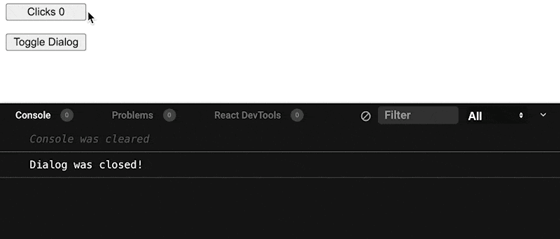

# `@ricokahler/stable-hooks` · [](https://bundlephobia.com/package/@ricokahler/stable-hooks) [](https://github.com/ricokahler/color2k/actions) [](https://codecov.io/gh/ricokahler/stable-hooks)

> hooks that unstable values for more control over incoming hook dependencies

## Motivation

In complex React components, it quickly becomes challenging to control how incoming values affect your downstream hooks.

For example, the following `<Dialog />` component has a bug that causes it to re-run the `onOpen` or `onClose` callbacks if the consumer does not wrap the callbacks in `useCallback`.

```js
import { useState, useEffect } from 'react';

function Dialog({ onOpen, onClose }) {
  const [open, setOpen] = useState(false);

  useEffect(() => {
    if (open) onOpen();
    else onClose();
  }, [open, onOpen, onClose]);

  return (
    <>
      <button onClick={() => setOpen(!open)}>Toggle Dialog</button>

      <dialog open={open}>
        <p>Greetings, one and all!</p>
      </dialog>
    </>
  );
}

export default function App() {
  const [clicks, setClicks] = useState(0);

  return (
    <>
      <button onClick={() => setClicks(clicks + 1)}>Clicks {clicks}</button>
      <Dialog
        onOpen={() => console.log('Dialog was opened!')}
        onClose={() => console.log('Dialog was closed!')}
      />
    </>
  );
}
```



`stable-hooks` are hooks you can use to wrap unstable values for more control over incoming hook dependencies.

## Usage

### `useStableGetter`

[implementation](https://github.com/ricokahler/stable-hooks/blob/main/src/use-stable-getter.ts) | [tests](https://github.com/ricokahler/stable-hooks/blob/main/src/use-stable-getter.test.tsx)

Wraps incoming values in a stable getter function that returns the latest value.

Useful tool for signifying a value should not be considered as a reactive dependency.

> **ℹ** When this getter is invoked, it _pulls_ the latest value from a hidden ref. This ref is synced with the current inside of a `useLayoutEffect` so that it runs before other `useEffect`s.

```js
import { useState, useEffect } from 'react';
import { useStableGetter } from '@ricokahler/stable-hooks';

function Dialog(props) {
  const [open, setOpen] = useState(false);

  const getOnOpen = useStableGetter(props.onOpen);
  const getOnClose = useStableGetter(props.onClose);

  useEffect(() => {
    const onOpen = getOnOpen();
    const onClose = getOnClose();
    if (open) onOpen();
    else onClose();
  }, [open, getOnOpen, getOnClose]);

  return (
    <>
      <button onClick={() => setOpen(!open)}>Toggle Dialog</button>

      <dialog open={open}>
        <p>Greetings, one and all!</p>
      </dialog>
    </>
  );
}
```

### `useStableCallback`

[implementation](https://github.com/ricokahler/stable-hooks/blob/main/src/use-stable-callback.ts) | [tests](https://github.com/ricokahler/stable-hooks/blob/main/src/use-stable-callback.test.tsx)

Returns a stable callback that does _not_ change between re-renders.

> **ℹ** The implementation uses `useStableGetter` to get latest version of the callback (and the values [closed within it](https://developer.mozilla.org/en-US/docs/Web/JavaScript/Closures)) so values are not stale between different invocations.

```js
import { useState, useEffect } from 'react';
import { useStableCallback } from '@ricokahler/stable-hooks';

function Dialog(props) {
  const [open, setOpen] = useState(false);

  const onOpen = useStableCallback(props.onOpen);
  const onClose = useStableCallback(props.onClose);

  useEffect(() => {
    if (open) onOpen();
    else onClose();
  }, [open, onOpen, onClose]);

  return (
    <>
      <button onClick={() => setOpen(!open)}>Toggle Dialog</button>

      <dialog open={open}>
        <p>Greetings, one and all!</p>
      </dialog>
    </>
  );
}
```

### `useStableValue`

[implementation](https://github.com/ricokahler/stable-hooks/blob/main/src/use-stable-value.ts) | [tests](https://github.com/ricokahler/stable-hooks/blob/main/src/use-stable-value.test.tsx)

Given an unstable value, `useStableValue` hashes the incoming value against a `hashFn` (by default, this is `JSON.stringify`) and if the hash is unchanged, the previous value will be returned.

Useful for defensively programming against unstable objects coming from props.

> **ℹ** The implementation runs the value through the provided hash function and the result of that hash function is used as the only dependency in a `useMemo` call. See the implementation here.

```js
function Example(props) {
  const style = useStableValue(props.style);

  useEffect(() => {
    // do something only when the _contents) of
    // the style object changes
  }, [style]);

  return <>{/* ... */}</>;
}
```
